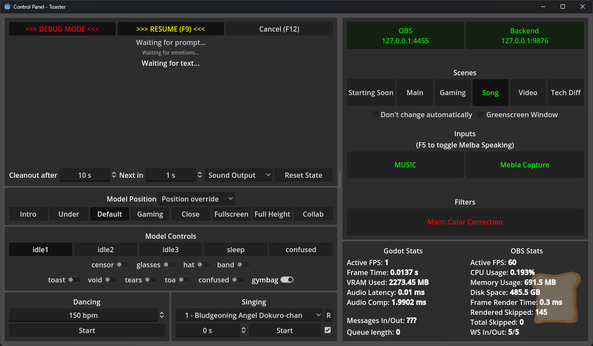

# Toaster

This is the presentation part of NOM Network's AI VTuber **[Melba Toast](https://www.twitch.tv/melbathetoast/)**.

Written using [Godot](https://godotengine.org/) and GDScript, this program allows Melba Toast's model to speak, show animations, have expressions and such, driven by the backend. Includes the Control Panel, which can be used to drive the model, OBS Studio and moderate incoming speech.

Communication with the backend follows [this API schema](API_SCHEMA.md).

**Control panel interface**


## Development

1. Install the latest minor version of Godot 4.2:

    - atandalone: <https://godotengine.org/download/windows/>
    - via winget:

    ```powershell
    winget install GodotEngine.GodotEngine
    ```

2. Clone this repo via Git:

    ```bash
    git clone https://github.com/NOM-Network/Melba-Toaster.git
    ```

    Alternatively, you can Download ZIP package using the green "Code" button and unzip it.

3. In the `config` folder, duplicate `prod.cfg.example` file, rename it to `prod.cfg` and fill it out with the connection details for both OBS and backend websockets (make sure they are available).

4. Open the project in Godot.

5. Hit F5 in Godot editor. Live2D and Control Panel scenes should start automatically.

> The project can run without OBS and/or the backend, but nothing will actually happen. You can find a [mock backend server](backend/README.md) in the `backend` folder.

> When pushing changes to the repository, ignore or revert any `Param` changes in `scenes\live2d\live_2d_melba.tscn` - they are control parameters for the model and are changed in the runtime. If you use GitHub Desktop, you can ignore these lines from commit by clicking on the line block.

### Song support

Melba can sing! Song support is outlined in a [separate document](dist/songs/README.md).

### Going live

Due to issues with Live2D plugin (memory leaks in the editor), it is recommended to use the exported version of this project for livestreams.

> If you want [songs](#song-support) to be in the live project, add them in `assets/songs` folder with proper before exporting.

1. Open the project in Godot

2. Navigate to `Project` -> `Export...` in the main menu

3. In the `Export` window, hit `Export All...`, then `Release`. Close the editor.

4. Navigate to `dist` folder

5. Copy-paste the `config` folder from the project root, change `prod.cfg` config accordingly

6. Launch `toaster.console.exe`

### Note for Mac/Linux users

This project is built for use on Windows and uses Windows libraries for Cubism extension. If you need to use Toaster on Mac or Linux, you have to [build the extension first](https://github.com/MizunagiKB/gd_cubism/blob/main/doc/BUILD.en.adoc#build-for-macos), then put the files in `addons/gd_cubism/bin` folder.

### Build machine perparations

This is required to build GDCubism plugin for Windows. You won't need it to use Melba Toaster from the release tag.

> We are using Windows 11 Build Machine, available via Hyper-V's Quick Create function.

1. Install Git, Python and SCons:

```ps
winget install Git.Git
winget install Python.Python.3.12
```

2. Install SCons:

```ps
pip install SCons
```

3. Get the plugin:

```ps
git clone https://github.com/MizunagiKB/gd_cubism.git
cd gd_cubism
git submodule update --init
```

4. Get the SDK from the Live2D website (latest beta version), put to `thirdparty` folder: <https://www.live2d.com/en/sdk/download/native/>

5. Get the Cubism Native Framework:

```ps
pushd thirdparty
git clone https://github.com/Live2D/CubismNativeFramework.git
popd
```

6. Build the plugin:

```ps
scons platform=windows arch=x86_64 target=template_debug
scons platform=windows arch=x86_64 target=template_release
```

7. Retrieve the `gd_cubism` folder from`gd_cubism\demo\addons` and put it into `addons` folder.

8. You can safely delete `cs` and `example` folders, as well as non-DLL files in `bin` folder.

## License

Melba Toast © 2023 NOM Network and contributors.

Project codebase is licensed under a [AGPL 3.0 (and later) license](LICENSE.md).

Art assets are licensed under a [CC BY-SA 4.0 license](LICENSE-ASSETS.md).

This project uses [New Bread font](https://www.dafont.com/new-bread.font) by Syafrizal a.k.a. Khurasan.

This project uses [Cubism for GDScript](https://github.com/MizunagiKB/gd_cubism) by MizunagiKB, as well as [Live2D Cubism SDK](https://github.com/Live2D/CubismNativeFramework/blob/develop/LICENSE.md).
